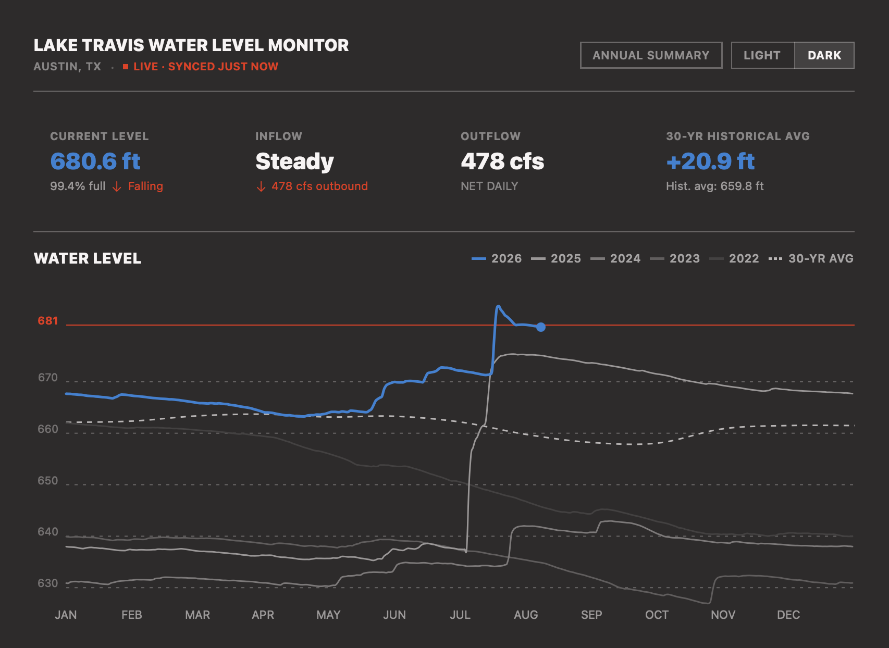

# LakeLevel

LakeLevel monitors real-time and historical water levels for all six LCRA Highland Lakes in Texas. It ships as two apps sharing one design and one data source:

- **macOS app** — native SwiftUI, see [macOS App](#macos-app) below
- **Web app** — live at **[highlandlakelevels.org](https://highlandlakelevels.org)**, React/Vite/TypeScript, source at **[mtmangum/lakelevel](https://github.com/mtmangum/lakelevel)**



## Features

- **All six Highland Lakes** — switch between Lake Buchanan, Inks, LBJ, Marble Falls, Travis, and Austin via the LAKE ▾ picker in the header
- **Dashboard** — current lake level, inflow, outflow, and vs-30-yr-average stats; updates automatically every hour
- **5-year overlay chart** — 2022–2026 lines on a shared Jan–Dec axis; current year in blue with a live endpoint dot
- **Year toggles** — single-tap hides/shows a year; double-tap isolates it
- **Interactive crosshair** — hover shows interpolated water level (ft) for every visible year
- **Drag to zoom** — drag across the chart to zoom into a date range; RESET to restore full view
- **Annual Summary popover** — header button opens a live min/max/avg/year-end table for the selected lake
- **Dark / Light mode** — toggled from the header; default is dark
- **Disk cache** (macOS) — chart renders instantly from cache on relaunch; network refresh runs in the background

## Design

Flat modernist system: SF Pro Heavy/Bold, zero corner radius, 1 px rule dividers, neutral ramp + `#2B82D4` water blue + `#EC3013` accent red. Tokens defined in `Theme.swift` (macOS) and `theme.ts` (web).

## Data

Live daily readings from [waterdatafortexas.org](https://waterdatafortexas.org/) (LCRA). Both the trailing-year CSV and the full historical record (since 1940) are fetched on launch and cached to `~/Library/Application Support/WaterLevel/`. Data refreshes automatically every hour while the app is running.

| Lake | Full Pool |
|---|---|
| Lake Buchanan | 1020.5 ft MSL |
| Lake Inks | 888.25 ft MSL |
| Lake LBJ | 824.0 ft MSL |
| Lake Marble Falls | 738.5 ft MSL |
| Lake Travis | 681.0 ft MSL |
| Lake Austin | 492.0 ft MSL |

## macOS App

### Requirements

- macOS 26 or later
- Xcode 26 or later

### Project structure

```
WaterLevel/
├── AppState.swift
├── WaterLevelApp.swift
├── Assets.xcassets/
├── Components/
│   ├── FlatSegmentedControl.swift
│   └── Tag.swift
├── Support/
│   ├── ChartGeometry.swift     — bezier path helpers (1000×255 SVG viewBox)
│   ├── Lake.swift              — Highland Lake definitions + per-lake coordinate math
│   ├── LakeDataService.swift   — CSV fetch, parse, and disk cache
│   ├── Theme.swift             — design tokens, AppFont, Spacing
│   └── WindowConfigurator.swift
└── Views/
    ├── ContentView.swift       — root layout: header + lake picker + dashboard
    └── Dashboard/
        ├── DashboardView.swift         — proportional layout (1/4 stats, 3/4 chart)
        ├── StatGridView.swift          — 4-column stat row
        ├── DashboardChartCard.swift    — 5-year overlay chart with crosshair + zoom
        └── Historical/
            └── HistoricalTableView.swift — live annual summary table
```

## Web App

Moved to its own repo: **[mtmangum/lakelevel](https://github.com/mtmangum/lakelevel)** (split out 2026-08-13, commit history preserved). Live at [highlandlakelevels.org](https://highlandlakelevels.org).
